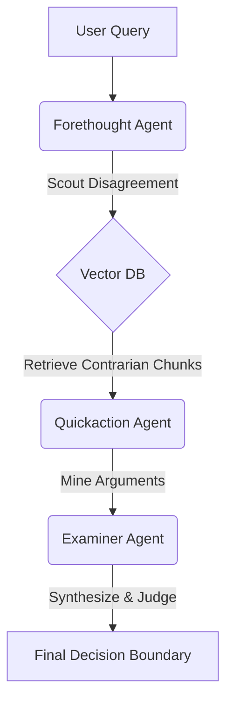

# Counter-Narrative Generator 🐟

  

> **"Founders don’t only need recall. They need judgment."**

Most RAG tools answer: *"What did Brian Chesky say about product-market fit?"*
This tool answers: *"In my situation, is 'move fast and break things' smart—or reckless?"*

The **Counter-Narrative Generator** mines 300+ episodes of [Lenny's Podcast](https://www.lennysnewsletter.com/podcast) to find **productive disagreement**. It doesn't just summarize; it **steelmans conflicting views** to help you see the decision boundary.


---

## 🧠 The Architecture: The "Three Fish" Framework

Inspired by the *Panchatantra* tale of three fish with different survival strategies, this system uses three specialized AI agents to simulate a debate:



| Agent | Role | Model | Function |
| :--- | :--- | :--- | :--- |
| **Forethought**<br>*(Anagatavidhata)* | **The Scout** | `Gemini 2.5 Flash` | Scans the vector DB for guests who *disagree* with your premise. Prioritizes tension over consensus. |
| **Quickaction**<br>*(Pratyutpannamati)* | **The Miner** | `Gemini 2.5 Flash Lite` | Extracts the strongest arguments for both sides, grounding every claim in specific transcript evidence. |
| **Examiner**<br>*(Yadbhavishya)* | **The Judge** | `Claude Sonnet 4.5` | Synthesizes the conflict. Defines the *boundary conditions* for when each view is correct. |

---

## ⚡ Quick Start

### 1. Setup
```bash
# Clone and install
git clone [https://github.com/Laksh-star/counter-narrative-generator.git](https://github.com/Laksh-star/counter-narrative-generator.git)
cd counter-narrative-generator
pip install -r requirements.txt

# Configure Environment
cp .env.example .env
# Edit .env and add your key: OPENROUTER_API_KEY=sk-or-v1-your-key
```

### 2. Ingest Data
This processes ~300 episodes (15,969 chunks) into a local vector store.
```bash
python main.py load
```

### 3. Run a Query
Challenge a piece of startup wisdom.
```bash
python main.py query "VC funding is a must to achieve unicorn status"
```

---

## 📊 Sample Output

**Query:** *"VC Funding is a must to achieve unicorn status"*

```text
📌 CONVENTIONAL WISDOM (Steelman):
   "VC funding enables companies to capture winner-take-all markets 
   and attract top talent..."

🔴 CONTRARIAN PERSPECTIVE (Steelman):
   "VC funding creates perverse incentives for hyper-growth often 
   before product-market fit..."

   ▸ Evidence (Patrick Campbell): "Many businesses achieve scale generating 
     tens of millions in cash flow without any VC funding."

⚖️ SYNTHESIS & DECISION BOUNDARY:
   Real Disagreement: Speed-at-all-costs vs. Sustainable Control.

   ✅ Conventional wisdom applies when:
      • Winner-take-all markets with strong network effects
      • First-mover advantage is critical

   ❌ Contrarian view applies when:
      • Competitive advantage is deep domain expertise, not scale
      • Profitability is achievable in 12-24 months

   💡 META-LESSON:
      The question isn't "Should I raise?" but "What game am I playing?"
      Don't adopt VC metrics if you aren't playing a VC game.
```

*See full JSON output: `examples/sample_vc_funding.json`*

---

## 🛠 Features & CLI Commands

* **Contrarian Boosting:** The retrieval engine up-ranks chunks containing linguistic markers of disagreement ("I disagree," "actually," "common misconception").
* **Interactive Mode:** Explore the corpus conversationally.
* **Traceability:** Every argument is cited with the specific Guest and Episode ID.

### Command Reference
```bash
python main.py load              # Load 15,969 chunks into ChromaDB
python main.py load --force      # Force reload (if chunking logic changes)
python main.py stats             # Show vector store statistics
python main.py query "belief"    # Challenge a conventional wisdom
python main.py query "belief" -v # Verbose mode (watch agents think)
python main.py query "belief" -s # Auto-save results to outputs/
python main.py interactive       # Interactive exploration mode
```

---

## 📂 Project Structure

```
├── main.py                      # CLI entry point
├── src/
│   ├── workflow.py             # Three-Fish orchestration
│   ├── agents/                 # The Agents
│   │   ├── forethought.py      # Contrarian Scout
│   │   ├── quickaction.py      # Argument Miner
│   │   └── examiner.py         # Debate Architect
│   └── data/
│       └── vectorstore.py      # ChromaDB integration
├── content/output/             # The Knowledge Base
│   ├── chunks.jsonl            # 15,969 searchable chunks (~280 words)
│   └── episodes_index.jsonl    # Metadata index
└── scripts/
    └── ingest_transcripts.py   # Raw text → JSONL pipeline
```

---

## 💾 The Data

The repository includes processed transcripts from **299 episodes** of Lenny's Podcast, featuring guests like **Brian Chesky, Marty Cagan, and Shreyas Doshi**.

### Re-processing the Corpus
If you want to adjust chunk sizes or overlap:
```bash
python scripts/ingest_transcripts.py \
  --input_dir /path/to/raw-transcripts \
  --output_dir content/output \
  --target_words 280 \
  --overlap_turns 1
```

---

## ⚙️ Configuration & Cost

This system is optimized for cost-performance balance using OpenRouter.

**Estimated Cost:** ~$0.02 - $0.05 per query.

| Variable | Default Model | Purpose |
| :--- | :--- | :--- |
| `FORETHOUGHT_MODEL` | `google/gemini-2.5-flash` | Fast, high-context retrieval |
| `QUICKACTION_MODEL` | `google/gemini-2.5-flash-lite` | Structured data extraction |
| `EXAMINER_MODEL` | `anthropic/claude-sonnet-4.5` | Nuanced reasoning & synthesis |

*Override these in your `.env` file.*

---

## 🤝 Contributing & License

**Background:** This project combines the *Panchatantra* (ancient Indian political science) with modern Agentic AI patterns. Read more about the philosophy here: [From the Terminator to Workflows](https://blog.stackademic.com/from-the-terminator-to-workflows-openai-agent-builders-promise-and-the-skeptics-at-the-gate-6d1e43ecf649). and accompaniment article here: [Lenny Shared 300+ Podcast Transcripts. I Built a Tool That Argues Back.](https://medium.com/@LakshmiNarayana_U/lenny-shared-300-podcast-transcripts-i-built-a-tool-that-argues-back-fff61bc9057f)

**License:** MIT

**Contributions:** Pull requests are welcome! If you want to adapt this pipeline for other corpuses (e.g., YC Essays, Huberman Lab), please fork and share your results.

---
*Built by [Laksh-star](https://github.com/Laksh-star).*


## License

MIT
