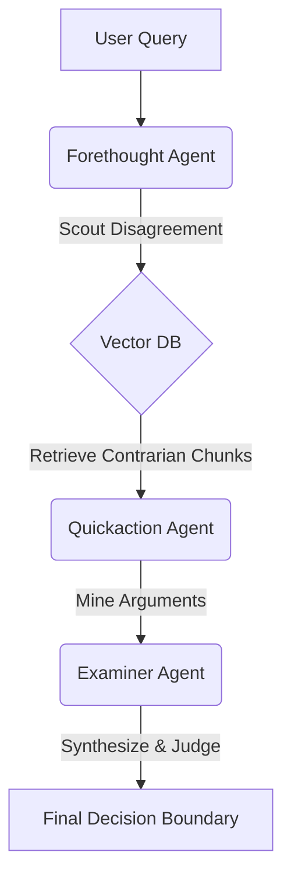

# Counter-Narrative Generator 🐟

   

> **"Founders don't only need recall. They need judgment."**

A full-stack web application that mines contrarian perspectives from Lenny's Podcast using a three-agent AI workflow. Most RAG tools answer *"What did Brian Chesky say?"* — this tool answers **"In my situation, is this advice smart or reckless?"**


## Overview

This application uses an agentic AI framework inspired by the Panchatantra to challenge conventional wisdom with evidence-based contrarian perspectives:

1. **Forethought (Scout)** - Searches for contrarian perspectives in a vector database of 300+ podcast episodes
2. **Quickaction (Miner)** - Structures arguments and identifies common themes
3. **Examiner (Architect)** - Synthesizes findings into a comprehensive decision framework

### Workflow Diagram



| Agent | Role | Model | Function |
| :--- | :--- | :--- | :--- |
| **Forethought**<br>*(Anagatavidhata)* | **The Scout** | `Gemini 2.5 Flash` | Scans the vector DB for guests who *disagree* with your premise. Prioritizes tension over consensus. |
| **Quickaction**<br>*(Pratyutpannamati)* | **The Miner** | `Gemini 2.5 Flash Lite` | Extracts the strongest arguments for both sides, grounding every claim in specific transcript evidence. |
| **Examiner**<br>*(Yadbhavishya)* | **The Judge** | `Claude Sonnet 4.5` | Synthesizes the conflict. Defines the *boundary conditions* for when each view is correct. |

## Architecture

### Backend (FastAPI)
- REST API with WebSocket support for streaming progress updates
- Wraps the original Python workflow with async capabilities
- ChromaDB for vector storage and semantic search
- OpenRouter API for LLM access (Gemini 2.5 Flash, Claude Sonnet 4.5)

### Frontend (Next.js)
- Modern React interface with TypeScript and Tailwind CSS
- Real-time progress tracking during query execution
- Formatted results display with collapsible sections
- Responsive design for desktop and mobile

### Deployment (Google Cloud Run)
- Serverless container deployment
- Auto-scaling based on traffic
- Pay-per-use pricing model
- Secrets managed via Google Secret Manager

## Quick Start

📖 **For complete step-by-step instructions**, see [SETUP.md](SETUP.md)

This covers:
- Fresh clone to running locally (web app & CLI)
- Deployment to Google Cloud Run
- Troubleshooting for all methods

### Prerequisites
- Docker and Docker Compose
- OpenRouter API key ([get one here](https://openrouter.ai/keys))
- For deployment: Google Cloud SDK ([install here](https://cloud.google.com/sdk/docs/install))

### Local Development

1. **Clone and setup environment**
   ```bash
   git clone <your-repo-url>
   cd "Converting Lenny app into Google Cloud app"
   cp .env.example .env
   ```

2. **Configure environment variables**
   Edit `.env` and add your `OPENROUTER_API_KEY`

3. **Start with Docker Compose**
   ```bash
   docker-compose up --build
   ```

4. **Access the application**
   - Frontend: http://localhost:3000
   - Backend API: http://localhost:8000
   - API docs: http://localhost:8000/docs

### Manual Setup (without Docker)

#### Backend
```bash
cd backend
python -m venv venv
source venv/bin/activate  # On Windows: venv\Scripts\activate
pip install -r requirements.txt
cp .env.example .env
# Edit .env and add your OPENROUTER_API_KEY
python main.py
```

#### Frontend
```bash
cd frontend
npm install
cp .env.example .env.local
# Edit .env.local and set NEXT_PUBLIC_API_URL
npm run dev
```

## Deployment to Google Cloud Run

Note: If you are building on Apple Silicon (M1/M2/M3), you must build **linux/amd64** images for Cloud Run. See troubleshooting below.

### 1. Initial Setup
```bash
cd deployment
./setup-gcp.sh
```
This will:
- Enable required GCP APIs
- Create secrets for API keys
- Configure your project

### 2. Deploy Backend
```bash
./deploy-backend.sh
```

### 3. Deploy Frontend
```bash
./deploy-frontend.sh
```

### 4. Access Your App
After deployment, you'll receive a URL like `https://counter-narrative-frontend-xxxxx-uc.a.run.app`

### Debug Toggle (Runtime)
To show the debug panel in the UI, add `?debug=1` or `?debug=true` to the frontend URL.

## Project Structure

```
├── backend/                 # FastAPI backend
│   ├── api/                # API routes and schemas
│   ├── services/           # Workflow service wrapper
│   ├── src/                # Original workflow code
│   ├── content/            # Vector store data
│   ├── main.py             # Application entry point
│   └── Dockerfile
├── frontend/               # Next.js frontend
│   ├── app/               # Next.js app directory
│   ├── components/        # React components
│   ├── lib/               # Utilities and API client
│   └── Dockerfile
├── deployment/            # Deployment scripts
│   ├── setup-gcp.sh      # GCP initialization
│   ├── deploy-backend.sh
│   └── deploy-frontend.sh
└── docker-compose.yml    # Local development
```

## API Endpoints

### REST API

- `GET /api/health` - Health check
- `GET /api/topics` - Get available topic filters
- `GET /api/stats` - Vector store statistics
- `POST /api/query` - Query for counter-narratives

#### Example Query Request
```json
{
  "belief": "You need product-market fit before you can scale",
  "topics": ["growth-strategy", "product-market-fit"],
  "n_results": 5,
  "user_context": "I'm a B2B SaaS founder with 100 users",
  "verbose": true
}
```

### WebSocket API

- `WS /api/query/stream` - Streaming queries with real-time progress

Connect to the WebSocket and send a query request to receive progress updates as each agent executes.

## Configuration

### Backend Environment Variables
```bash
OPENROUTER_API_KEY=your_key_here
PORT=8000
HOST=0.0.0.0
CORS_ORIGINS=http://localhost:3000
FORETHOUGHT_MODEL=google/gemini-2.5-flash  # Optional
QUICKACTION_MODEL=google/gemini-2.5-flash-lite  # Optional
EXAMINER_MODEL=anthropic/claude-sonnet-4.5  # Optional
```

### Frontend Environment Variables
```bash
NEXT_PUBLIC_API_URL=http://localhost:8000
```

## Cost Estimates

### Development
- **Docker Compose**: Free (runs locally)
- **OpenRouter API**: ~$0.02-$0.05 per query

### Production (Google Cloud Run)
- **Backend**:
  - With traffic: ~$10-30/month (1 min instance)
  - No traffic: ~$0-5/month (0 min instances)
- **Frontend**: ~$0-10/month
- **OpenRouter API**: $0.02-$0.05 per query
- **Total**: ~$20-50/month for moderate usage

## Features

### Current
- ✅ Web interface for querying counter-narratives
- ✅ Real-time progress tracking via WebSocket
- ✅ Formatted results with collapsible sections
- ✅ Topic filtering (12 categories)
- ✅ Adjustable number of perspectives (1-10)
- ✅ Optional user context for personalized guidance
- ✅ Docker containerization
- ✅ Google Cloud Run deployment

### Future Enhancements
- [ ] User authentication
- [ ] Query history and saved results
- [ ] Export to PDF/Markdown
- [ ] Admin dashboard for analytics
- [ ] Custom data source uploads
- [ ] Mobile app (React Native)

## Troubleshooting

### Backend Issues

**ChromaDB not loading**
```bash
cd backend
# Ensure data files exist
ls content/output/chunks.jsonl
```

**API key errors**
```bash
# Verify API key is set
echo $OPENROUTER_API_KEY
```

### Frontend Issues

**Can't connect to backend**
- Check that `NEXT_PUBLIC_API_URL` is set correctly
- Verify backend is running: `curl http://localhost:8000/api/health`

### Cloud Run Issues

**Image manifest error (Apple Silicon builds)**
Use buildx with amd64:
```bash
docker buildx build --platform linux/amd64 --output=type=docker -t gcr.io/$PROJECT_ID/your-image .
docker push gcr.io/$PROJECT_ID/your-image
```

**Backend tries to rebuild embeddings in Cloud Run**
- Ensure `backend/chroma_db` is included in the backend image (do not ignore it).

**Secret updated but still failing**
- Secret changes require a **new Cloud Run revision**. Redeploy the backend after updating secrets.

### Docker Issues

**Build failures**
```bash
# Clean Docker cache
docker-compose down -v
docker system prune -a
docker-compose up --build
```

## Development

### Running Tests
```bash
# Backend
cd backend
pytest

# Frontend
cd frontend
npm test
```

### Code Formatting
```bash
# Backend
black .
flake8 .

# Frontend
npm run lint
npm run format
```

## Contributing

1. Fork the repository
2. Create a feature branch (`git checkout -b feature/amazing-feature`)
3. Commit your changes (`git commit -m 'Add amazing feature'`)
4. Push to the branch (`git push origin feature/amazing-feature`)
5. Open a Pull Request

## License

This project is based on the original Counter-Narrative Generator CLI tool.

## Acknowledgments

- Original CLI tool by Laksh
- Inspired by the Panchatantra and Andrew Ng's agentic workflows
- Data from Lenny's Podcast episodes
- Built with FastAPI, Next.js, and deployed on Google Cloud Run

## Support

For issues, questions, or contributions:
- Open an issue on GitHub
- Check the [deployment guide](docs/DEPLOYMENT.md)
- Review the [API documentation](docs/API.md)
